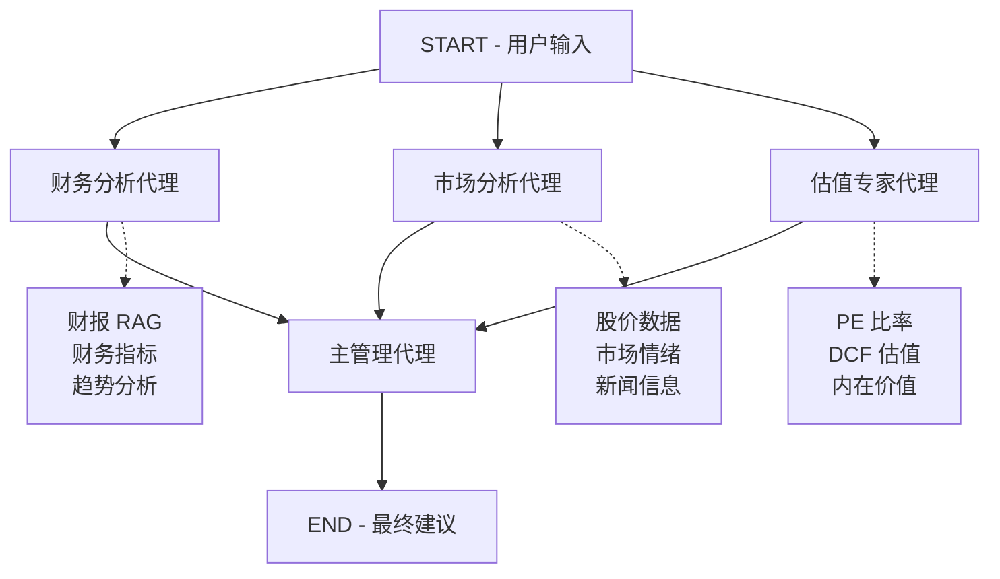

# 股票投资 AI 助手 (LangGraph 版本)

> 使用 **LangGraph** 和 **DeepSeek** 构建的企业级多代理股票投资分析系统

[](https://github.com/langchain-ai/langgraph)
[](https://www.python.org/)
[](https://langchain-ai.github.io/langgraph/)
[](https://fastapi.tiangolo.com/)

---

## 📋 目录

- [核心特性](#-核心特性)
- [系统架构](#️-系统架构)
- [快速开始](#-快速开始)
- [API 文档](#-api-文档)
- [项目结构](#-项目结构)
- [配置说明](#️-配置说明)
- [进阶用法](#-进阶用法)
- [故障排除](#-故障排除)
- [技术栈](#-技术栈)

---

## 🚀 核心特性

### 1. LangGraph 多代理编排

- ✅ 并行执行三个专家代理（财务、市场、估值）
- ✅ 自动依赖管理和状态传递
- ✅ 完整的工作流可观测性和调试能力
- ✅ 内置检查点和持久化支持

### 2. 智能代理系统

| 代理 | 功能描述 |
|------|----------|
| 🏦 **财务分析代理** | 分析财务报表、财务比率、趋势变化 |
| 📈 **市场分析代理** | 股价走势、市场情绪、新闻舆情 |
| 💎 **估值专家代理** | PE、PB、DCF 等多维度估值方法 |
| 👔 **主管理代理** | 综合所有分析，生成最终投资建议 |

### 3. 财报 RAG 系统

- 📄 自动加载和处理 PDF 财报
- 🔍 语义检索 + 向量搜索
- 💾 Chroma 向量数据库
- ⚡ 高效的信息检索

### 4. 生产级特性

- 🔐 完整的错误处理和日志系统
- 📊 自动生成 API 文档 (Swagger UI + ReDoc)
- 🔄 CORS 跨域支持
- 🚦 健康检查和监控端点
- 💾 检查点和状态持久化

---

## 🏗️ 系统架构

### LangGraph 工作流图



### 代理交互流程

```
┌─────────────────────────────────────────────────────────────┐
│                        用户请求                              │
│  ├─ 股票代码: AAPL                                          │
│  ├─ 问题: 值得投资吗？                                       │
│  └─ 分析偏好: [财务, 市场, 估值]                            │
└────────────────────────┬────────────────────────────────────┘
                         │
                         ▼
        ┌────────────────────────────────────┐
        │    LangGraph 执行引擎              │
        │  (自动处理并行、顺序、状态)         │
        └────────────────┬───────────────────┘
                         │
        ┌────────────────┼────────────────┐
        │                │                │
        ▼                ▼                ▼
   ┌─────────┐     ┌─────────┐     ┌─────────┐
   │ 财务分析 │     │ 市场分析 │     │ 估值分析 │
   │         │     │         │     │         │
   │ 检索财报 │     │ 获取价格 │     │ 计算 PE │
   │ 计算比率 │     │ 评估情绪 │     │ DCF模型 │
   │ 分析趋势 │     │ 分析新闻 │     │ 内在价值│
   └────┬────┘     └────┬────┘     └────┬────┘
        │                │                │
        └────────────────┼────────────────┘
                         │
                         ▼
             ┌───────────────────────┐
             │   主管理代理综合分析   │
             │   生成投资建议         │
             └───────────┬───────────┘
                         │
                         ▼
             ┌───────────────────────┐
             │  返回结构化建议        │
             │  • 评分 (1-10)        │
             │  • 建议 (买/持/卖)    │
             │  • 目标价格           │
             │  • 风险评估           │
             └───────────────────────┘
```

---

## ⚡ 快速开始

### 前置要求

| 要求 | 版本/说明 |
|------|-----------|
| **Python** | 3.10 或更高 |
| **DeepSeek API Key** | [获取地址](https://api.deepseek.com) |
| **内存** | 8GB+ (推荐 16GB+) |
| **包管理器** | pip 或 conda |

### 1️⃣ 克隆项目

```bash
git clone https://github.com/your-username/stock-ai-assistant.git
cd stock-ai-assistant
```

### 2️⃣ 创建虚拟环境

```bash
# 使用 venv
python -m venv venv

# 激活虚拟环境
source venv/bin/activate          # Linux/Mac
# 或
.\venv\Scripts\activate           # Windows
```

### 3️⃣ 安装依赖

```bash
# 升级 pip
pip install --upgrade pip

# 安装项目依赖
pip install -r requirements.txt
```

### 4️⃣ 配置环境变量

```bash
# 复制环境变量模板
cp .env.example .env

# 编辑 .env 文件
nano .env  # 或使用你喜欢的编辑器
```

**配置示例 (`.env`)：**

```bash
# ========== DeepSeek API ==========
DEEPSEEK_API_KEY=sk-your-api-key-here
DEEPSEEK_API_BASE=https://api.deepseek.com/v1

# ========== RAG 配置 ==========
VECTOR_STORE_PATH=data/vector_store
PDF_DIRECTORY=data/financial_reports
CHUNK_SIZE=1000
CHUNK_OVERLAP=200

# ========== LangGraph 检查点 ==========
CHECKPOINTS_PATH=data/checkpoints

# ========== 服务器配置 ==========
HOST=0.0.0.0
PORT=8000
DEBUG=True
```

### 5️⃣ 准备财报数据

```bash
# 创建财报目录（如果不存在）
mkdir -p data/financial_reports

# 将 PDF 财报放入目录
cp /path/to/AAPL_2024_10K.pdf data/financial_reports/
cp /path/to/MSFT_2024_10K.pdf data/financial_reports/
```

### 6️⃣ 启动应用

```bash
# 开发模式（自动重载）
python main.py

# 或使用 uvicorn
uvicorn main:app --reload
```

**预期输出：**

```
==================================================
🚀 股票投资 AI 助手（LangGraph 版本）启动中...
==================================================
📚 初始化 RAG 系统...
✅ 已加载 X 个文档块
✅ 应用启动完成
==================================================
INFO:     Uvicorn running on http://0.0.0.0:8000
INFO:     Press CTRL+C to quit
```

### 7️⃣ 访问应用

在浏览器中打开：

| 功能 | URL |
|------|-----|
| **Swagger UI** | http://localhost:8000/docs |
| **ReDoc** | http://localhost:8000/redoc |
| **API 根路由** | http://localhost:8000 |

---

## 📚 API 文档

### 主要端点

#### 1. 完整股票分析（推荐）

**请求：**

```http
POST /api/analyze
Content-Type: application/json

{
  "stock_ticker": "AAPL",
  "query": "苹果公司是否值得投资？"
}
```

**响应：**

```json
{
  "stock_ticker": "AAPL",
  "query": "苹果公司是否值得投资？",
  "timestamp": "2024-01-15T10:30:00",
  "analysis": "综合分析结果...",
  "recommendation": "买入",
  "target_price": 185.50
}
```

**工作流：**

1. 📊 财务分析代理执行 (并行)
2. 📈 市场分析代理执行 (并行)
3. 💎 估值专家代理执行 (并行)
4. 👔 主管理代理综合所有结果
5. 📤 返回结构化建议

#### 2. 仅财务分析

```http
POST /api/analyze/financial?stock_ticker=AAPL&query=收入增长如何？
```

#### 3. 仅市场分析

```http
POST /api/analyze/market?stock_ticker=AAPL&query=市场情绪如何？
```

#### 4. 仅估值分析

```http
POST /api/analyze/valuation?stock_ticker=AAPL&query=内在价值是多少？
```

#### 5. RAG 查询财报

```http
POST /api/rag/query?query=苹果收入&stock_ticker=AAPL
```

#### 6. 初始化 RAG

```http
POST /api/rag/initialize
```

#### 7. 健康检查

```http
GET /health
```

#### 8. 应用信息

```http
GET /api/info
```

---

### 使用示例

#### Python

```python
import requests

url = "http://localhost:8000/api/analyze"
payload = {
    "stock_ticker": "AAPL",
    "query": "苹果公司 2024 年值得投资吗？"
}

response = requests.post(url, json=payload)
result = response.json()
print(f"建议: {result['recommendation']}")
print(f"评分: {result.get('score', 'N/A')}")
```

#### cURL

```bash
curl -X POST "http://localhost:8000/api/analyze" \
  -H "Content-Type: application/json" \
  -d '{
    "stock_ticker": "AAPL",
    "query": "苹果公司值得投资吗？"
  }'
```

#### JavaScript/TypeScript

```javascript
const analyzeStock = async (ticker, query) => {
  const response = await fetch("http://localhost:8000/api/analyze", {
    method: "POST",
    headers: { "Content-Type": "application/json" },
    body: JSON.stringify({
      stock_ticker: ticker,
      query: query
    })
  });
  
  const result = await response.json();
  console.log(result);
  return result;
};

// 使用示例
analyzeStock("AAPL", "苹果公司值得投资吗？");
```

---

## 📁 项目结构

```
stock-ai-assistant/
│
├── 📄 main.py                       # FastAPI 应用入口
├── 📄 requirements.txt              # 项目依赖
├── 📄 .env.example                  # 环境变量示例
├── 📄 .gitignore                    # Git 忽略文件
├── 📄 README.md                     # 项目文档
│
├── 📁 config/                       # 配置模块
│   ├── __init__.py
│   ├── settings.py                  # 配置管理（Pydantic）
│   └── prompts.py                   # 系统提示词模板
│
├── 📁 data/                         # 数据存储
│   ├── 📁 financial_reports/        # PDF 财报文件
│   │   └── .gitkeep
│   ├── 📁 vector_store/             # Chroma 向量数据库
│   │   └── .gitkeep
│   └── 📁 checkpoints/              # LangGraph 检查点
│       └── .gitkeep
│
└── 📁 src/                          # 源代码模块
    ├── __init__.py
    │
    ├── 📁 core/                     # 核心模块
    │   ├── __init__.py
    │   ├── llm.py                   # DeepSeek LLM 初始化
    │   └── models.py                # Pydantic 数据模型
    │
    ├── 📁 rag/                      # 检索增强生成模块
    │   ├── __init__.py
    │   ├── loader.py                # PDF 加载和处理
    │   └── retriever.py             # 向量检索
    │
    ├── 📁 tools/                    # 工具函数模块
    │   ├── __init__.py
    │   ├── financial.py             # 财务分析工具
    │   ├── market.py                # 市场数据工具
    │   └── valuation.py             # 估值计算工具
    │
    └── 📁 graph/                    # 🆕 LangGraph 核心模块
        ├── __init__.py
        ├── state.py                 # 状态定义（TypedDict）
        ├── nodes.py                 # 节点函数（代理逻辑）
        └── workflow.py              # 工作流定义
```

---

## ⚙️ 配置说明

### 环境变量详解

| 变量名 | 说明 | 默认值 | 必填 |
|--------|------|--------|------|
| `DEEPSEEK_API_KEY` | DeepSeek API 密钥 | - | ✅ |
| `DEEPSEEK_API_BASE` | API 基础 URL | `https://api.deepseek.com/v1` | ❌ |
| `VECTOR_STORE_PATH` | 向量数据库路径 | `data/vector_store` | ❌ |
| `PDF_DIRECTORY` | 财报文件目录 | `data/financial_reports` | ❌ |
| `CHUNK_SIZE` | 文档分块大小 | `1000` | ❌ |
| `CHUNK_OVERLAP` | 分块重叠大小 | `200` | ❌ |
| `CHECKPOINTS_PATH` | 检查点存储路径 | `data/checkpoints` | ❌ |
| `HOST` | 服务器地址 | `0.0.0.0` | ❌ |
| `PORT` | 服务器端口 | `8000` | ❌ |
| `DEBUG` | 调试模式 | `False` | ❌ |

---

## 🎯 进阶用法

### 自定义代理提示词

编辑 `config/prompts.py` 文件来自定义代理行为：

```python
FINANCIAL_AGENT_PROMPT = """
你是一位资深财务分析师...
[自定义提示词]
"""
```

### 添加新的分析工具

在 `src/tools/` 目录下创建新的工具模块：

```python
# src/tools/sentiment.py
def analyze_sentiment(stock_ticker: str) -> dict:
    """分析股票市场情绪"""
    # 实现逻辑
    pass
```

### 调整工作流

在 `src/graph/workflow.py` 中修改 LangGraph 工作流：

```python
from langgraph.graph import StateGraph

workflow = StateGraph(AgentState)
workflow.add_node("financial", financial_agent)
workflow.add_node("market", market_agent)
# 添加新节点...
```

---

## 🔧 故障排除

### 常见问题

#### 1. API Key 错误

```
Error: Invalid API key
```

**解决方案：**
- 检查 `.env` 文件中的 `DEEPSEEK_API_KEY` 是否正确
- 确认 API key 有效且未过期

#### 2. 端口被占用

```
Error: Address already in use
```

**解决方案：**
```bash
# 查找占用端口的进程
lsof -i :8000

# 杀死进程
kill -9 <PID>

# 或更改端口
PORT=8001 python main.py
```

#### 3. PDF 加载失败

```
Error: No documents found in directory
```

**解决方案：**
- 确认 `data/financial_reports/` 目录下有 PDF 文件
- 检查文件权限
- 运行 `POST /api/rag/initialize` 重新初始化

#### 4. 内存不足

```
Error: Out of memory
```

**解决方案：**
- 减少 `CHUNK_SIZE` 配置
- 限制同时加载的文档数量
- 增加系统内存

---

## 🛠️ 技术栈

### 核心框架

- **[LangGraph](https://langchain-ai.github.io/langgraph/)** - 多代理编排框架
- **[LangChain](https://python.langchain.com/)** - LLM 应用开发框架
- **[FastAPI](https://fastapi.tiangolo.com/)** - 现代 Web 框架

### AI/ML

- **[DeepSeek](https://www.deepseek.com/)** - 大语言模型
- **[Chroma](https://www.trychroma.com/)** - 向量数据库
- **[Sentence Transformers](https://www.sbert.net/)** - 语义嵌入

### 数据处理

- **[PyPDF](https://pypdf.readthedocs.io/)** - PDF 解析
- **[Pydantic](https://docs.pydantic.dev/)** - 数据验证
- **[Python-dotenv](https://github.com/theskumar/python-dotenv)** - 环境变量管理

---

## 📄 许可证

本项目采用 **MIT License** 开源协议。

---

## 🤝 贡献指南

欢迎提交 Issue 和 Pull Request！

1. Fork 本仓库
2. 创建特性分支 (`git checkout -b feature/AmazingFeature`)
3. 提交更改 (`git commit -m 'Add some AmazingFeature'`)
4. 推送到分支 (`git push origin feature/AmazingFeature`)
5. 开启 Pull Request

---

## 📧 联系方式

- **作者**: tianshenbupa
- **邮箱**: lyc7895153@163.com
- **项目主页**: https://github.com/tianshenbupa/stock-ai-assistant-langGraph
---

<div align="center">

**⭐ 如果这个项目对你有帮助，请给个 Star！⭐**

Made with ❤️ by tianshenbupa


</div>


